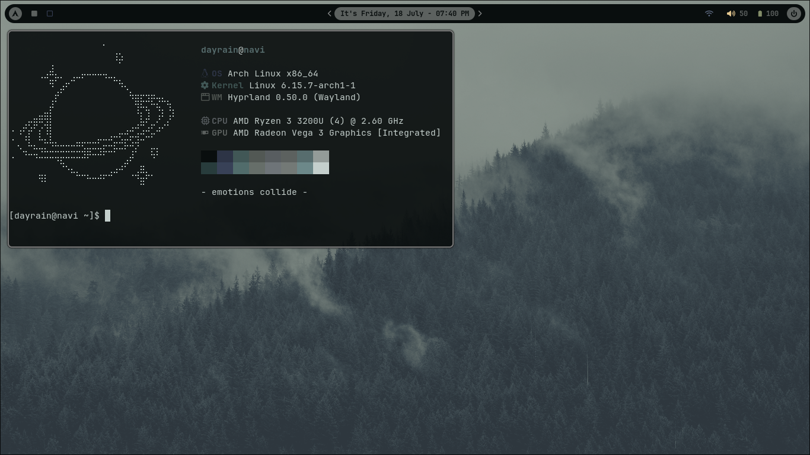

# Dotfiles

- OS: [Arch Linux](https://archlinux.org)
- WM/Compositor: [Hyprland](https://hyprland.org/)
- Terminal: [foot](https://codeberg.org/dnkl/foot)
- Menu: [fuzzel](https://codeberg.org/dnkl/fuzzel)
- Text Editor: [neovim](https://neovim.io/)
- Video Player: [mpv](https://mpv.io/)
- Music Player: [rmpc](https://mierak.github.io/rmpc/)
- Colorscheme: [hellwal](https://github.com/danihek/hellwal)
- Browser: [Librewolf](https://librewolf.net/)

